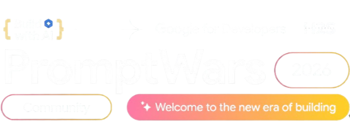

<div align="center">
  
</div>

<br/>


**Turn course syllabi into smart timelines & personalized study roadmaps.**

ChronoScribe AI is an AI-powered student workspace that reads a syllabus, assignment sheet, or course document and automatically extracts every deadline, quiz, exam, and project — then generates a decomposed, milestone-based study plan tailored to your available time and target grade.

<div align="center">

Built for **PROMPT WARS** — Google for Developers × Hack2Skill × Android Club, VIT Bhopal.


<br/><br/>

[](https://ai-powered-student-workspace.vercel.app)

</div>

---

## ✨ Features

- **📄 Multi-format ingestion** — Upload a PDF, DOCX, TXT, or Markdown syllabus (drag-and-drop or file picker), or paste text directly. All parsing happens client-side — no files are uploaded to a server.
- **🤖 AI deadline extraction** — Uses Google Gemini to identify every assignment, lab, quiz, midterm, exam, and project, along with due dates, weightage, and estimated workload.
- **🧩 Decomposed milestones** — Each deliverable is broken into 2–4 actionable sub-tasks so large assignments stop feeling overwhelming.
- **🗓️ Three ways to view your workload** — Timeline view, Gantt/calendar view, and a personalized weekly study roadmap.
- **🎯 Personalization controls** — Set your target grade goal, pacing strategy (balanced / procrastinator-rescue / deep-mastery), and available study hours per day; the AI adapts the plan accordingly.
- **⚡ Zero-setup demo mode** — One-click sample syllabi let anyone try the full flow instantly, with no API key required (a smart local fallback generates a realistic plan).
- **📤 Export & sync** — Download an `.ics` calendar file (with 24-hour and 3-day reminder alarms) for Google Calendar / Apple Calendar / Outlook, copy a Markdown summary for Notion/Obsidian, or print a clean summary sheet.
- **🔒 Private by design** — Your Gemini API key and documents stay in the browser (localStorage/sessionStorage); nothing is sent to a backend.

## 🛠 Tech Stack

<div align="center">
  
</div>

<br/>

- **Frontend:** React 18 + Vite
- **Styling:** Tailwind CSS
- **AI:** Google Gemini API (`gemini-1.5-flash` / `gemini-2.0-flash` / `gemini-1.5-pro`, with automatic fallback)
- **Document parsing:** `pdfjs-dist` (PDF), `mammoth` (DOCX)
- **Icons:** lucide-react
- **Extras:** `canvas-confetti`, `clsx`
- **Deployment:** Vercel

## 📦 Project Structure

```
AI-Powered-Student-Workspace/
├── src/
│   ├── components/
│   │   ├── Navbar.jsx
│   │   ├── UploadSection.jsx        # Upload/paste input + personalization controls
│   │   ├── TimelineView.jsx         # Deadline timeline
│   │   ├── GanttCalendarView.jsx    # Gantt/calendar view
│   │   ├── StudyPlanRoadmap.jsx     # Weekly study roadmap
│   │   ├── ExportModal.jsx          # ICS / Markdown / Print export
│   │   └── ApiKeyModal.jsx          # Gemini API key entry
│   ├── services/
│   │   ├── gemini.js                # Gemini API calls + JSON schema + fallback
│   │   ├── fileParser.js            # PDF / DOCX / text extraction
│   │   ├── calendarExport.js        # .ics + Markdown export generation
│   │   └── sampleData.js            # Demo syllabi + fallback dataset
│   ├── App.jsx
│   ├── main.jsx
│   └── index.css
├── index.html
├── tailwind.config.js
├── postcss.config.js
├── vite.config.js
└── package.json
```

## 🚀 Getting Started

### Prerequisites

- Node.js (v18 or later recommended)
- npm

### Installation

```bash
git clone https://github.com/RishiRaj1495/AI-Powered-Student-Workspace.git
cd AI-Powered-Student-Workspace
npm install
```

### Run the development server

```bash
npm run dev
```

The app will be available at `http://localhost:5173`.

### Build for production

```bash
npm run build
npm run preview
```

### (Optional) Add a Gemini API key

The app works out of the box using built-in sample syllabi and a smart fallback dataset — no key required to try it. To get live AI extraction on your own documents:

1. Get a free API key from [Google AI Studio](https://makersuite.google.com/app/apikey).
2. Open the app, click the API key icon in the navbar, and paste your key.
3. The key is stored only in your browser's `localStorage` and is sent directly to Google's API — never through a backend.

## 📋 How It Works

1. Upload a syllabus (PDF/DOCX/TXT/MD) or paste the text, or pick a 1-click demo preset.
2. Set your target grade, pacing strategy, and daily available study hours.
3. Gemini extracts every deliverable into structured JSON (title, type, due date, weight, estimated hours, urgency, milestones) and generates a weekly study plan.
4. Browse the results as a Timeline, Gantt/Calendar, or Roadmap.
5. Export to `.ics`, Markdown, or print — and sync straight to your calendar.

## 🏆 Credits

Built for **PROMPT WARS**, organized by **Google for Developers × Hack2Skill × Android Club, VIT Bhopal**.

### 👤 Built By

<div align="center">
<table>
  <tr>
    <td align="center">
      <a href="https://github.com/RishiRaj1495">
        <br/>
        <sub><b>Rishi Raj</b></sub>
      </a>
    </td>
  </tr>
</table>
</div>

## 📄 License

No license has been specified yet for this repository. Add a `LICENSE` file to define usage terms.

<div align="center">
  
</div>
